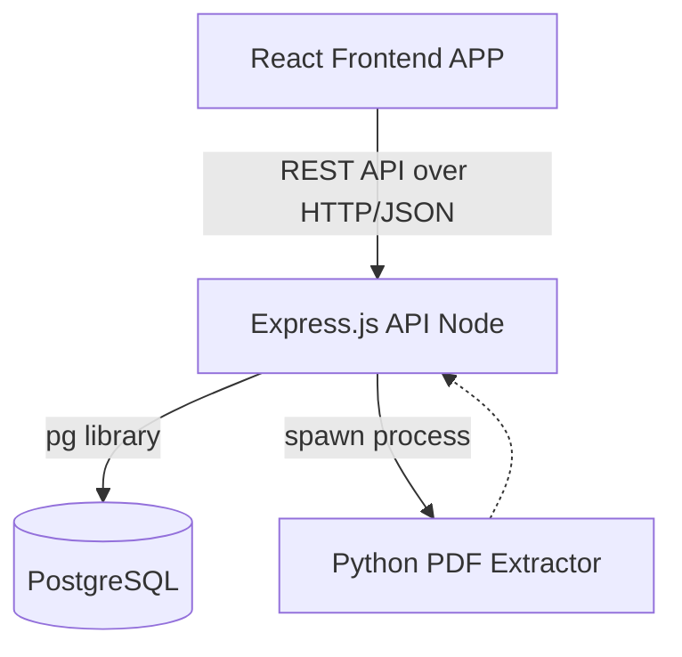

# 1. PROJECT OVERVIEW

**What the project does:**
This is an enterprise Management System (often referred to as 'AgriTrust') with a centralized Admin Panel and a Salesman Dashboard. It is designed to manage physical inventory across multiple "godowns" (warehouses) and vehicles, track daily sales routed through salesmen, import digitized PDF invoices/receipts, maintain an immutable stock ledger, and manage secure authentications.

**Tech Stack:**
*   **Frontend:** React 18, Vite, React Router, TailwindCSS, Lucide-React (icons).
*   **Backend:** Node.js, Express.js.
*   **Database:** PostgreSQL (Neon).
*   **External/Specific Tools:** Python (spawns child processes for PDF invoice extraction via `extractor.py`).
*   **Hosting:** Configured for Vercel (Frontend, via `vercel.json` rewrites) and Render/Node servers (Backend).

**Folder Structure Explained:**
*   `/src`: Contains the React application (SPA).
    *   `/src/features/`: Modular frontend domains (e.g., `admin`, `auth`).
    *   `/src/App.tsx`: Main routing and layout configuration.
*   `/backend`: Contains the Express server.
    *   `/backend/index.js`: Express entry point, middleware setup, PDF parsing handlers.
    *   `/backend/operations.js`: Core business logic, transactional database queries, and REST routes.
    *   `/backend/security.js`: Authentication, session verification, rate limiting, and password hashing.
    *   `/backend/invoice_extraction/`: Python scripts for external parsing logic.
*   `/schema.sql`: Authoritative PostgreSQL definition schema.
*   `/vercel.json`: Frontend deployment routing instructions.

---

# 2. ARCHITECTURE (IN DETAIL)

**Overall Architecture Type:**
Monolith. The backend is a single Node.js/Express service handling both REST API routing and direct PostgreSQL database interactions. The frontend is a standalone Single Page Application (SPA).

**High-level Architecture Diagram:**

**Components and Connections:**
*   **API Layer:** Express handles routing, limits payload sizes (50MB), and validates HTTP protocols.
*   **Auth Interceptor:** `security.js` intercepts routes under `/api/v2/`, looks up the Sha256-hashed Bearer token against `auth_sessions`, attaching Role/User to `req`.
*   **Transaction Wrapper:** Features modifying data are wrapped in `endpoint()` and `operation()`, which binds requests to an Postgres Advisory Lock and standardizes `COMMIT/ROLLBACK`.
*   **Idempotency Engine:** Prevents duplicate network insertions by caching successful payload hashes inside `api_operations`.

**Database Schema & Validation:**
*   **`products`:** Core SKUs containing structural details like `units_per_strip`, `strips_per_box`.
*   **`invoices` & `sale_items`:** Financial records of sales. Status toggle for 'VALID'/'VOID'.
*   **`stock_ledger`:** Immutable append-only log of inventory movements (`LOAD_IN`, `LOAD_OUT`, etc.). Aggregated dynamically via `SUM()` to calculate Godown/Vehicle balances.

**Deployment Setup:**
*   **Frontend (Vercel):** `vercel.json` rewrites all requests to `/index.html` to allow React Router to handle screen changes on the client side.
*   **Database (Neon DB):** Remotely hosted.
*   **Backend:** Runs in standard Node environment; reliant on an internal Python environment (`venv/bin/python`) for the PDF tooling.

---

# 3. COMPLETE WORKFLOW

### a) Frontend Workflow
1.  **Boot & Routing:** User loads `index.html`. `src/App.tsx` configures a `BrowserRouter`.
2.  **Auth Context:** First, `<AuthProvider>` calls `/api/v2/session` via `useApi` hook to hydrate user data. If unauthenticated, they are forced to `/login`.
3.  **UI Layout:** Validated users render `<AdminLayout>`, showing standard sidebars dynamically mapped utilizing `lucide-react` icons.
4.  **Data Fetching:** When a user navigates to `/manual-stock`, the component fires concurrent `fetchApi` GET requests to populate dropdowns (Godowns and Products).
5.  **State Updation:** Re-renders using `useState`.

### b) Backend Workflow
1.  **Ingress:** Request hits `index.js`, parses CORS and JSON bodies.
2.  **Auth Guard (Middleware):** `security.js` intercepts, queries `auth_sessions`, validates expiration, and enforces role clearance.
3.  **Controller & Idempotency:** The request hits `operations.js`. If via `POST/PUT`, it runs through the `operation(pool, req, name, fn)` wrapper which establishes an advisory lock and records the `idempotency-key` into `api_operations`.
4.  **Transaction Execution:** `transaction(pool, fn)` generates a `BEGIN` statement. Modifies multiple tables.
5.  **Audit:** An `audit_log` row is asynchronously written linking the User's footprint.
6.  **Response:** The wrapper safely responds JSON, or `catch(e)` converts PG constraint exceptions into readable HTTP 400/409 errors.

---

# 4. API DOCUMENTATION (REQUEST AND RESPONSE)

| Methodology | Details |
| :--- | :--- |
| **Method & URL** | `POST /api/v2/admin/login` |
| **Purpose**| Authenticate administrators and generate persistent session. |
| **Headers**| `Content-Type: application/json` |
| **Request**| `{"username": "admin", "password": "mypassword"}` |
| **Success**| `200 OK` - `{"token": "hex_string", "user": {"id": "admin", "role": "admin"}}` |
| **Errors** | `401 Unauthorized` ("Invalid credentials"), `429 Too Many Requests` |
| **Handler**| `backend/security.js: limiter, login('admin')` |

| Methodology | Details |
| :--- | :--- |
| **Method & URL** | `POST /api/v2/admin/inventory/import` |
| **Purpose**| Save PDF/OCR extracted data rigidly into database as a purchase action. |
| **Headers**| `Authorization: Bearer <token>`, `Content-Type: application/json` |
| **Request**| `{"import_ref": "INV-123", "supplier_name": "Acme", "godown_id": "g-1", "lines": [...]}` |
| **Success**| `200 OK` - `{"success": true, "id": "imp_uuid"}` |
| **Errors** | `400 Bad Request` ("Item 1: quantity must be positive"), `409 Conflict` |
| **Handler**| `backend/index.js: saveInventoryImport()` |

| Methodology | Details |
| :--- | :--- |
| **Method & URL** | `GET /api/v2/admin/sales` |
| **Purpose**| Obtain aggregated sales metrics and latest invoice array by date filters. |
| **Headers**| `Authorization: Bearer <token>` |
| **Request**| `?period=week` (Query params: `date`, `period`) |
| **Success**| `200 OK` - `{"stats": {"totalSales": 1000, "totalOrders": 1, ...}, "invoices": [...]}` |
| **Errors** | `401 Unauthorized`, `500 Server Error` |
| **Handler**| `backend/operations.js: lines ~153-210` |

---

# 5. CODE QUALITY REVIEW (WHAT IS LACKING)

| File | Line / Function | Problem | Why it matters | Severity |
| :--- | :--- | :--- | :--- | :--- |
| `operations.js` | Entire file | **God Class / Tight Coupling:** File is hundreds of lines long housing nearly all routes, SQL queries, and business utilities. | Hard to maintain, merge conflicts, difficult to test logic independently. | High |
| `security.js` | `const failures = new Map();` | **In-Memory Rate Limiting:** State is completely lost on process restart. | In a multi-node environment, an attacker can bypass rate-limits via load balancer round-robin. | Medium |
| `index.js` | `const allowedOrigins = ...` | **Permissive CORS default:** `!origin` allows tools like Postman to bypass CORS. | Can lead to unauthorized internal administrative scripts exploiting instances. | Low |
| `operations.js` | `const sumSQL = ...` | **Heavy Abstraction:** SQL strings injected as text replaces (`.replaceAll('type', 'l.type')`). | Extremely prone to typos, lack of IDE syntax highlighting, debugging nightmare. | Medium |
| `index.js` | `export function installOperations(app, pool)` | **Export/Bootstrap pattern:** Route mounting mixed randomly. | Pollutes router space unexpectedly. | Low |

---

# 6. VULNERABILITY AND SECURITY ANALYSIS

| Vulnerability | Location | Risk Level | How it can be exploited | Fix |
| :--- | :--- | :--- | :--- | :--- |
| **Denial of Service (DoS)** | `index.js`: `extractInvoicePdf()` | High | Attacker uploads very complex but small PDFs. `child.stdout.on` tries to buffer up to 5MB, Python process eats CPU. | Implement strict resource limits on `spawn` (via Node's `maxBuffer`), or offload to a background worker queue (e.g., SQS/Redis). |
| **Memory Leak (App Sec)** | `security.js`: `failures.set(key, entry)` | Medium | Sending requests from thousands of spoofed distinct IPs will indefinitely fill `failures` Map until OOM crash. | Sweep old map keys regularly, or preferably replace with a Redis-backed rate limiter (`express-rate-limit` + Redis). |
| **Authentication Logic Flaw** | `security.js`: `safeUser()` | Low | If `req.user` leaks back to client unexpectedly, omitting fields is manual. | Strict DTO (Data Transfer Object) validations needed. | 

---

# 7. PERFORMANCE ANALYSIS (WHY IT IS SLOW)

| Bottleneck | Location | Why it is slow | Impact | Fix |
| :--- | :--- | :--- | :--- | :--- |
| **1. Dynamic Aggregation / N+1 Risk** | `operations.js`: `stock_ledger` queries | `SUM(CASE WHEN ... ELSE 0 END)` running in real-time over the entire historical ledger on every Godown load. | Will noticeably lag API responses once ledger hits 100K+ rows. | Implement a materialized view, or a dedicated `current_balance` column triggered by insert events. |
| **2. Process Spawing overhead** | `index.js`: `spawn(pyBin)` | Spawning a cold python interpreter per PDF upload takes 100ms-400ms alone. | Blocks server threads waiting for file I/O and process allocation. | Wrap Python script in a lightweight persistent FastAPI/Flask microservice, call it via HTTP. |
| **3. Lack of API Pagination** | `operations.js`: `app.get('/:table')` | Entire tables (`products`, `customers`) are returned fully via `SELECT * ... ORDER BY name`. | UI will freeze, and backend bandwidth cost will skyrocket. | Implement `?limit=50&offset=0` immediately. |

---

# 8. HOW TO FIX EVERYTHING

### A) Refactor Rate Limiter (Security / Scalability)
*   **Explained:** Map blocks memory and fails horizontally.
*   **Fix:** Replace Map with Redis, or sweep it.
*   **Effort:** Medium.

### B) Refactor Aggregation Queries (Performance)
*   **Explained:** Stop calculating every historic movement math on the fly.
*   **Fix:** Create a trigger-maintained column in the DB, or a Materialized View.
*   **Effort:** High.

### C) Organize God Class (Code Quality)
*   **Explained:** `operations.js` is too large.
*   **Fix:** Create a `routes/` folder. Distinct files for `routes/products.js`, `routes/sales.js`.
*   **Effort:** Medium (Mostly Cut & Paste).

---

# 9. SCALABILITY AND FUTURE IMPROVEMENTS

**What breaks at 10x or 100x Growth?**
1.  **Postgres Connection Pooling:** Currently `connectionTimeoutMillis: 10000` is set. With 100x concurrent salesmen uploading requests, the `pg` pool restricts by default to 10 connections. The server will freeze waiting for `pool.connect()`.
2.  **PDF Extractions:** 10 users uploading invoices simultaneously will spawn 10 Python contexts eating ~1-2GB RAM (depending on PDFMiner footprint), crashing Render's standard node container with 'Memory Limit Exceeded'.

**Recommended Architecture Changes:**
*   Move to a proper **Microservices/Worker Architecture**. Place `RabbitMQ` or `BullMQ` (Redis) between Express and the Python script.
*   Move static file hosting strictly to CDN.

---

# 10. SETUP AND MAINTENANCE GUIDE

**Installation:**
1.  Frontend: `npm install` inside `/admin-dashboard`.
2.  Backend: `npm install` inside `/admin-dashboard/backend`.
3.  Python Setup: Create virtual environment in `backend/invoice_extraction/venv` and install `pdfminer` or required packages explicitly utilized in `extractor.py`.

**Environment Variables Required:**
*   `DATABASE_URL` : Valid Postgres/Neon connection string.
*   `VITE_API_BASE_URL` : Base mapping for Frontend fetching.
*   `CORS_ORIGINS` : Comma separated allowed origins for security.
*   `ADMIN_PASSWORD_HASH` / `ADMIN_USERNAME` : Bootstrap credentials.

---

# 11. SUMMARY

**Overall Project Health Score:** **6.5 / 10**
The codebase executes fundamentally solid concepts (idempotency, transaction locks, Bearer token auth) which is miles ahead of many bootstrapped systems. However, its architectural execution inside a monolithic God file paired with synchronous blocking loops and heavy dynamic SQL calculations drastically pull down its long-term viability and performance scores.

**Top 10 Most Important Fixes:**
1.  Paginate the `/api/v2/admin/:table` endpoints immediately.
2.  Extract backend `operations.js` into separated Controller modules.
3.  Enqueue the Python PDF Spawner processing to prevent Node thread starvation/OOM crashes.
4.  Remove string-injections from SQL queries (like `.replaceAll()`).
5.  Migrate dynamic stock balance aggregation to caching/materialization logic.
6.  Migrate `failures` Map rate-limiter to Redis.
7.  Verify CORS `allowedOrigins` securely rejects postman/curl if intended strictly for browser.
8.  Add automated testing (Jest/Vitest).
9.  Enforce data transfer object (DTO) stripping for outgoing user metadata.
10. Implement database pooling upgrades (PgBouncer) scaling constraints before adding >50 concurrent salesmen.
